# Using IDAPython to fix Coronalock (BigLock) IAT in IDA

# Table of contents

1. [Introduction](#introduction)
2. [Tools](#tools)
2. [Unpacking the sample](#unpackingthesample)
4. [The IAT loader](#iatloader)
5. [Fixing the IAT](#fixingiat)
6. [Conclusion](#conclusion)

# Introduction <a name="introduction"></a>

Malware analysts know very well that malware authors use everything in their power to make the analysis of a sample as difficult as possible. They mutate the code, use anti-debugging and anti-virtual machines techniques, use code splicing, IAT ([Import Address Table](https://docs.microsoft.com/en-us/windows/win32/debug/pe-format#import-address-table)) redirection, etc; sometimes is easy to get rid off a given ``protection`` mechanism and sometimes is not, it depends on many factors such as analyst's skills, tools available, if the protection mechanism is publicly known, etc. This time, I want to show you a common technique used by ransomware. In fact, I have come across this technique several times from different ransomwares families that I have analyzed lately.

It's very common to see ransomware samples packed with customs or public packers and implementing a runtime IAT loader. Basically, the samples start with a very tiny IAT (some times not even that) and then, during its execution, start to build a much bigger IAT with all the functions needed to work properly. This makes the static analysis of the sample a little bit harder because the IAT is, sometimes, placed outside the PE image. Some other times, they just use direct calls/jumps to API functions making the PE dump to contain bad references.

[Biglock](https://id-ransomware.blogspot.com/2020/05/biglock-ransomware.html) a.k.a Coronalock is not an exception, [the sample I've analyzed](https://www.virustotal.com/gui/file/e2c2a80cb4ecc511f30d72b3487cb9023b40a25f6bbe07a92f47230fb76544f4/detection) has two layers and the last one includes a runtime IAT loader.

# Tools <a name="tools"></a>

- Windows 7 x64
- OllyDbg + Ollydump
- IDA + IDAPython

# Unpacking the sample <a name="unpackingthesample"></a>

The unpacking process is really simple. The first time I unpacked the sample, I ended up removing two layers from the original sample. Unfortunately, I didn't write the necessary steps I followed. However, when trying to replicate the work for this tutorial, I found an easier approach that allows to directly jump to the second layer at once without the need of removing any extra layer first.

The sample calls several times to VirtualAlloc in order to create memory regions and place there some encrypted code, decrypt them and then overwrites the image its executing by previously doing a call to VirtualProtect. So, the simple way to unpack it is to place a breakpoint there and trace until the point the code jumps to the OEP.

To make the story short, you'll see that the third time it stops, you'll land in a place like this:

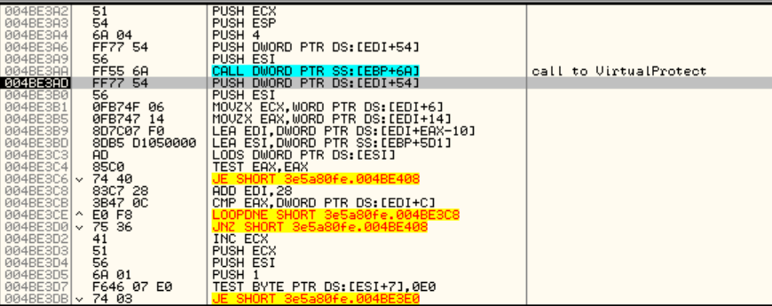

If you trace the code a little bit you'll see that the only thing it does is to get a pointer to each of the PE sections and call VirtualProtect to restore the original protections that were modified in order to overwrite the original code, no mysterious here.

After that, it does a final call to VirtualProtect to mark the PE header as PAGE_EXECUTE_READWRITE and finally jumps to the OEP:

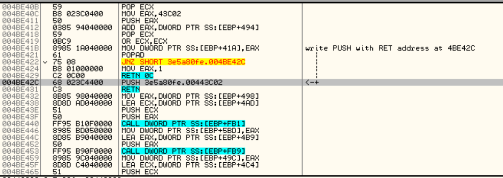

If you look at the string xrefs at this point, you'll see that strings were decrypted:

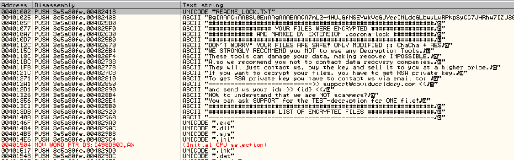

The following is a picture of the original ones:

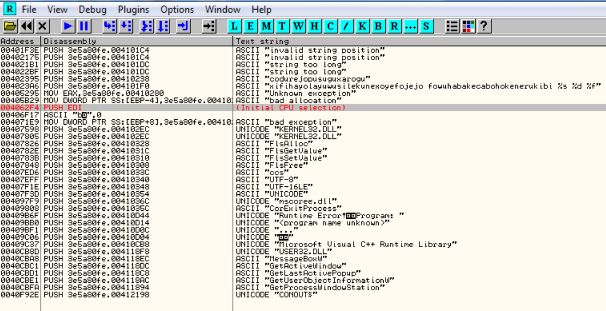

The only thing you have to do at this point is to use Ollydump, or the dumper of your choice, to dump the memory to a file.

# The IAT loader <a name="iatloader"></a>

If you didn't close Ollydbg when you had the sample stopped at the OEP, you'll note that there's an IAT:

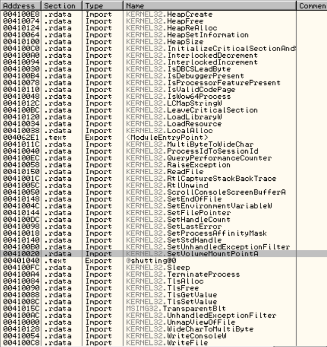

However, this IAT is the old one. For some reason, Ollydbg didn't refresh it, is still getting the old data from the PE header. If you load the dumped file into Ollydbg and check the .import sections, you'll see nothing in it's new IAT created by Ollydump during the dumping process:

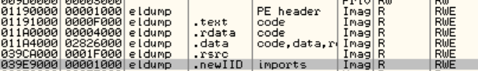

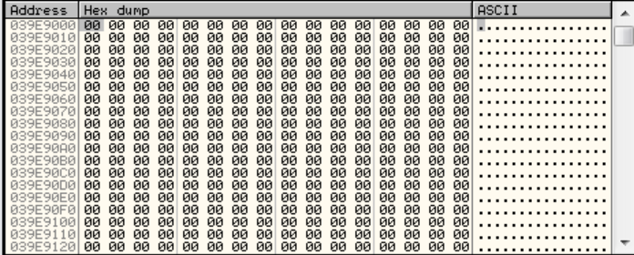

This is because, the decrypted code corrupted the .import section on the original file before reaching the OEP. In the following picture, you can see that the IAT data was replaced by code:

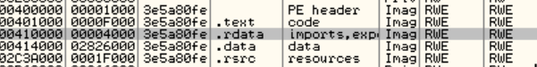
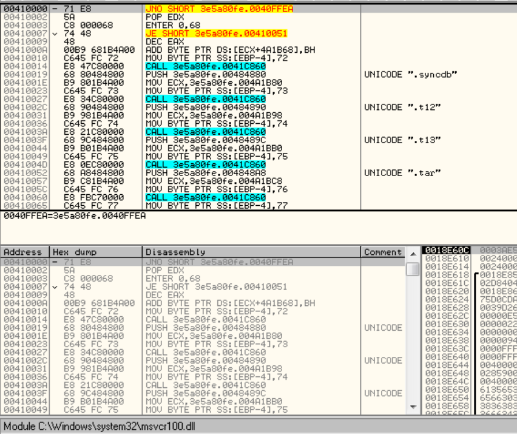

If you look at the same section in the original file, you'll see the right IAT:

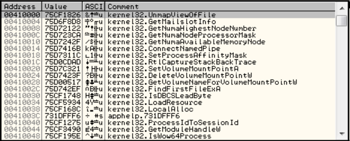

It's clear that the ransomware stopped at the OEP will need an new IAT in order to be able to call functions from the Windows API. This is achieved by building a new IAT in runtime.

If you look at the string xrefs in IDA, you can see that there are a lot of API names there, some of them are from the Microsoft CryptoAPI, which is very common in ransomware:

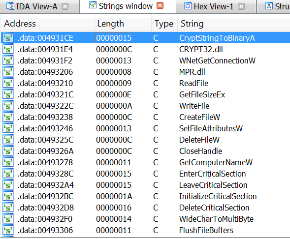

These strings are not directly referenced in the code, so pressing "x" over it is not going to work. However, by examining the code a little bit it can be seen that there are some constructions like this:

```
.data:004283B3                 push    eax
.data:004283B4                 push    0
.data:004283B6                 push    0
.data:004283B8                 push    8
.data:004283BA                 push    0
.data:004283BC                 push    dword ptr [ebx+14h]
.data:004283BF                 call    dword_475000 --> direct call
```

The call to ``dword_475000`` is going here:

```
.data:00475000 dword_475000    dd 74EF9186h            ; DATA XREF: .data:004283BF↑r
.data:00475000                                         ; .data:0042845E↑r
.data:00475004 dword_475004    dd 74F0460Dh            ; DATA XREF: sub_423390+19B2↑r
.data:00475008 dword_475008    dd 74F01456h            ; DATA XREF: sub_423390+19DB↑r
.data:00475008                                         ; sub_423390+1BEA↑r
.data:0047500C dword_47500C    dd 74F0407Eh            ; DATA XREF: sub_423390+1BAB↑r
.data:00475010 dword_475010    dd 74F0461Dh            ; DATA XREF: sub_423390+19B8↑r
.data:00475014 dword_475014    dd 74F0429Ch            ; DATA XREF: sub_423390+11D↑r
.data:00475018 dword_475018    dd 74EFC9ECh            ; DATA XREF: sub_423390+374↑r
.data:00475018                                         ; sub_423390+3E2↑r ...
.data:0047501C dword_47501C    dd 74EF7914h            ; DATA XREF: sub_423390+1AD5↑r
.data:00475020 dword_475020    dd 74EFDEEEh            ; DATA XREF: sub_429400+1A↑r
.data:00475024 dword_475024    dd 74EFDED6h            ; DATA XREF: sub_429400+36↑r
.data:00475028 dword_475028    dd 74EFDF06h            ; DATA XREF: sub_4293E0+C↑r
.data:0047502C dword_47502C    dd 74EFDF1Eh            ; DATA XREF: sub_429460+25↑r
.data:0047502C                                         ; sub_429460+4D↑r
.data:00475030 dword_475030    dd 74EFC4BAh            ; DATA XREF: sub_428320+C↑r
.data:00475034                 db 0B4h ; ´
.data:00475035                 db 0DEh ; Þ
.data:00475036                 db 0EFh ; ï
.data:00475037                 db  74h ; t
.data:00475038 dword_475038    dd 74F17733h            ; DATA XREF: sub_4285D0+42↑r
.data:00475038                                         ; sub_4285D0+78↑r
.data:0047503C dword_47503C    dd 74F33284h            ; DATA XREF: .data:004286CD↑r
.data:00475040 dword_475040    dd 74F014FAh            ; DATA XREF: sub_41DDB0+113↑r
```

This table is the IAT that was dynamically built by the ransomware before reaching the OEP but was dumped ``as is`` by Ollydump. You can check this by looking at it in Ollydbg:

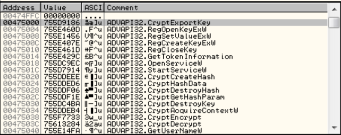

However, Ollydbg is not able to find references to this addresses, mostly because they are called in a direct way. 

If you are curious about where the IAT is built, you just need to put a ``HW`` (hardware) breakpoint ``on-write`` (``DWORD``) at the beginning of the table (``dword_475000``) and trace from there. If you do it, you'll see that the breakpoint hits several times before reaching this point:

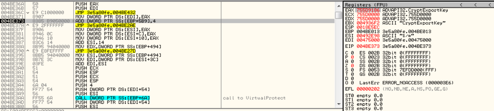

You can see the following line:

```
004BE371    8907            MOV DWORD PTR DS:[EDI],EAX
```

In which the value from ``EAX`` (the address of the CryptExportKey function) was moved to the address pointed by ``EDI`` (``00475000``).

The information to build the IAT (function names) is placed in the .data section and is retrieved by the following code:

```
004BE2E2    03DA            ADD EBX,EDX ; get offset in the .data section where function string is
004BE2E4    43              INC EBX
004BE2E5    43              INC EBX
004BE2E6    53              PUSH EBX ; push the name of the function
004BE2E7    81E3 FFFFFF7F   AND EBX,7FFFFFFF
004BE2ED    53              PUSH EBX ; push the name of the function
004BE2EE    FFB5 B5050000   PUSH DWORD PTR SS:[EBP+5B5] ; push module handle
004BE2F4    FF95 B10F0000   CALL DWORD PTR SS:[EBP+FB1]                          ; call GetProcAddress
```

Here's the picture of the .data section with all the function names:

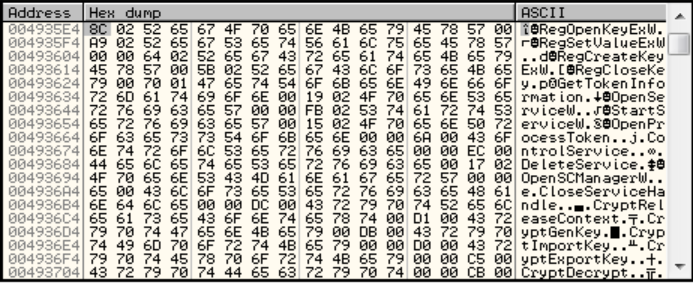

# Fixing the IAT <a name="fixingiat"></a>

The right way to do the work, let's say a "conservative" way, if you wish, is to find where the new IAT is built and take notes of the start address and size in order to feed an IAT re-builder such us ImportREC in order to build the new IAT in a new section **before** dumping the process. But let's suppose that we missed that part, what can we do at this point?. Another solution is to use the information we have in Ollydbg to feed an IDAPython script in order to rename the addresses we have in IDA and make the static analysis in IDA a little bit easier. So, I basically wrote the following script in order to fix that:

```python
import idautils
import idc

from struct import unpack

api_list = ["CryptExportKey", "RegOpenKeyExW", "RegSetValueExW", "RegCreateKeyExW", "RegCloseKey", "GetTokenInformation", "OpenServiceW", "StartServiceW", "CryptCreateHash", "CryptHashData", "CryptDestroyHash", "CryptGetHashParam", "CryptDestroyKey", "CryptAcquireContextW", "CryptEncrypt", "CryptDecrypt", "GetUserNameW", "CryptImportKey", "CryptGenKey", "CryptReleaseContext", "CloseServiceHandle", "OpenSCManagerW", "DeleteService", "ControlService", "OpenProcessToken", "CryptStringToBinaryA", "IcmpSendEcho", "IcmpSendEcho2", "IcmpParseReplies", "GetAdaptersInfo", "IcmpCreateFile", "IcmpCloseHandle", "SetEvent", "WaitForSingleObjectEx", "GetLogicalDrives", "FindFirstFileW", "FindNextFileW", "WaitForMultipleObjects", "GetQueuedCompletionStatus", "JUNK_ENTRY", "ResumeThread", "PostQueuedCompletionStatus", "GetExitCodeThread", "TerminateThread", "CreateThread", "ExitProcess", "CreateIoCompletionPort", "HeapCreate", "RtlFreeHeap", "HeapLock", "RtlAllocateHeap", "HeapDestroy", "CreateEventW", "RtlSizeHeap", "RtlGetLastWin32Error", "CreateProcessW", "WaitForSingleObject", "GetCurrentProcess", "lstrcpyW", "Process32FirstW", "lstrcatW", "Process32NextW", "CreateToolhelp32Snapshot", "OpenProcess", "TerminateProcess", "GetShortPathNameW", "GetEnvironmentVariableW", "OpenMutexW", "CreateMutexW", "GetModuleFileNameW", "FlushFileBuffers", "WideCharToMultiByte", "RtlDeleteCriticalSection", "InitializeCriticalSection", "RtlLeaveCriticalSection", "RtlEnterCriticalSection", "GetComputerNameW", "CloseHandle", "DeleteFileW", "SetFileAttributesW", "GetProcessHeap", "SetEnvironmentVariableW", "FreeEnvironmentStringsW", "GetEnvironmentStringsW", "GetCommandLineW", "GetCommandLineA", "GetOEMCP", "GetACP", "IsValidCodePage", "FindFirstFileExW", "VirtualQuery", "RtlReAllocateHeap", "GetTimeZoneInformation", "ReadConsoleW", "SetStdHandle", "EnumSystemLocalesW", "GetUserDefaultLCID", "IsValidLocale", "GetTimeFormatW", "CreateFileW", "WriteFile", "GetFileSizeEx", "ReadFile", "WriteConsoleW", "SetEndOfFile", "HeapUnlock", "GetDateFormatW", "GetFullPathNameW", "RtlSetLastWin32Error", "InitializeCriticalSectionAndSpinCount", "SwitchToThread", "TlsAlloc", "TlsGetValue", "TlsSetValue", "TlsFree", "GetSystemTimeAsFileTime", "GetModuleHandleW", "GetProcAddress", "RtlEncodePointer", "RtlDecodePointer", "MultiByteToWideChar", "GetStringTypeW", "CompareStringW", "LCMapStringW", "GetLocaleInfoW", "GetCPInfo", "IsProcessorFeaturePresent", "IsDebuggerPresent", "UnhandledExceptionFilter", "SetUnhandledExceptionFilter", "GetStartupInfoW", "QueryPerformanceCounter", "GetCurrentProcessId", "GetCurrentThreadId", "RtlInitializeSListHead", "LocalFree", "RtlUnwind", "RaiseException", "FreeLibrary", "LoadLibraryExW", "GetDriveTypeW", "GetFileInformationByHandle", "GetFileType", "PeekNamedPipe", "SystemTimeToTzSpecificLocalTime", "FileTimeToSystemTime", "GetModuleHandleExW", "GetStdHandle", "SetFilePointerEx", "GetConsoleCP", "GetConsoleMode", "GetCurrentDirectoryW", "WNetGetConnectionW", "NetShareEnum", "NetApiBufferFree", "VariantClear", "SHGetFolderPathW", "ShellExecuteExW", "SHEmptyRecycleBinW", "ShellExecuteW", "inet_addr"]

start = idc.read_selection_start()
end = idc.read_selection_end()

index = 0

if start != BADADDR:
	print "[+] Fixing IAT. Start: %x - End: %x - Size: %x" % (start, end, end - start)
	print "--------------------------"
	while start < end:
		bytes = get_bytes(start, 4)
		if unpack("<L", bytes)[0] != 0:
			idc.set_name(start, api_list[index])
			print "--> Name: %s set at: %x" % (api_list[index], start)
			index +=1
		else:
			print "[!] Bytes are zero at: %x" % start
		start += 4
		
```

In order to make the script work, we need to select from the start of the table to the end of it and then run the script with ``ALT+F7``. In this case, the start of the table is ``00475000`` and the end is ``004752A0``.

After the script ran, this is the result:

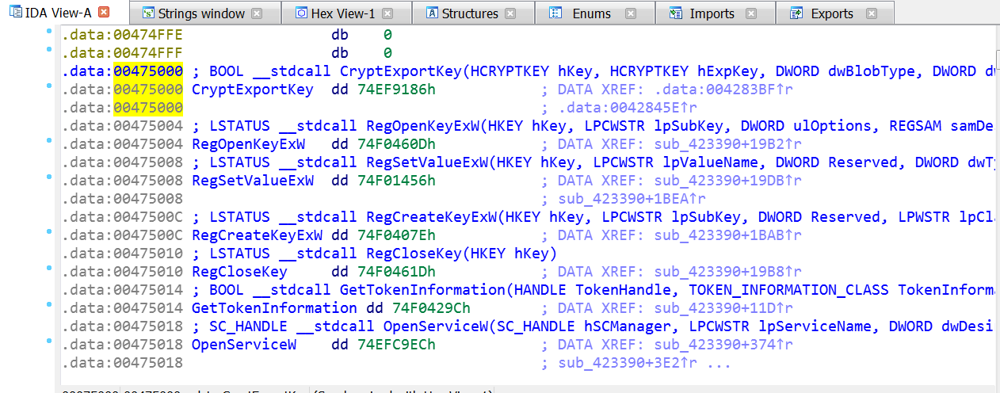

Now it's a little bit easier to analyze the code ;P

# Conclusion <a name="conclusion"></a>

In this small post, I showed you the right and wrong way to do the things :P Sometimes you don't have the time to perform an exaustive analysis of a sample and you use a shortcut in order to achieve your goal, that's precisely what I did here. 

I showed you an unorthodox way of fixing an IAT (maybe "fixing" is too much, let's say .. mmm .. decorate) in Coronalock in order to have all the function references with names to make the analysis easier.

I hope you enjoyed the reading and see you next time!. 